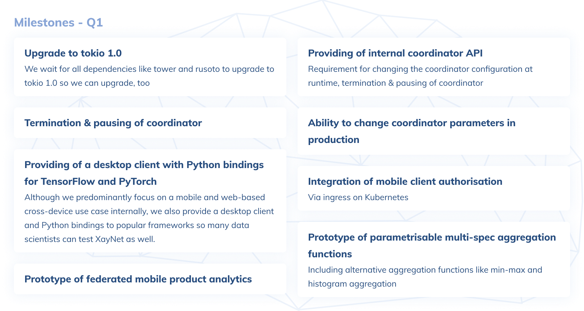
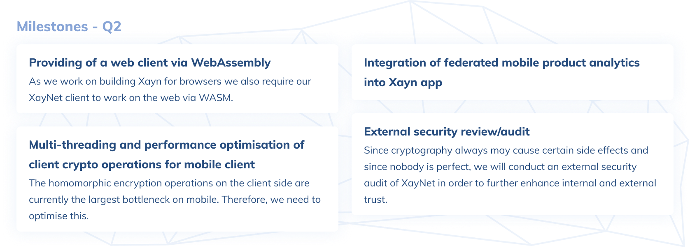

# Roadmap 2021

In Q1 we focus entirely on using XayNet for the [Xayn app] in terms of federated learning and
first simple analytics, such as gathering relevant AI performance data like [NDCG metrics]
because we want to know how our AI models perform without violating the privacy of our users.
As you know, our framework originated with the aim to aggregate machine learning models securely
and privately between edge devices. Thereby, the models are transformed into one-dimensional lists
so that at the end we only aggregate a list of numbers, so why not also aggregate other numerical
analytics data, like AI performance metrics or user behaviour, such as screen times in our app,
all of course with the privacy guarantees of XayNet. As such, we focus predominantly on mobile
cross-device learning but also extend our framework to cover such use cases. In Q1 we take however
mostly care about the internal mobile case and testing so we set the basis to further
generalisation to external cases in the community during the rest of the year.

In Q2 we have three main focus points: Extending XayNet to support also web applications, since
also our [Xayn app] will be provided as a web version via [WASM]; integrating our product analytics
extensions in our [Xayn app] and optimising the client for higher performance, which is one the
major bottlenecks.

In Q3, we can imagine to opening up the analytics layer also to more general use cases outside of
Xayn itself. Until then our core focus is predominantly internally, yet, of course we hope to get
community and external feature suggestions and reviews. Also we want to make the coordinator more
observable as a foundation for further optimisations.

[Xayn app]: https://www.xayn.com/
[NDCG metrics]: https://en.wikipedia.org/wiki/Discounted_cumulative_gain#Normalized_DCG
[WASM]: https://webassembly.org/
